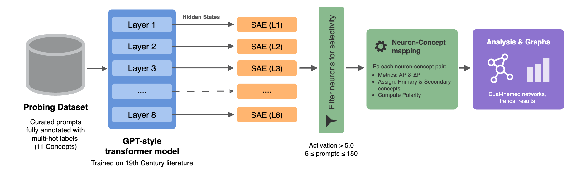

<p align="center">
  
</p>

# GPT & Prejudice

This repository contains the codebase, datasets, and analysis scripts accompanying the paper: <br/>
**"GPT & Prejudice: Using Sparse Autoencoders to Uncover Conceptual Structures in 19th-Century Literature"**
*(under peer review)*

🔗 Link to the paper: [/arXiv.2510.01252](https://doi.org/10.48550/arXiv.2510.01252)  
🔗 Link to the model: [HTW-KI-Werkstatt/gpt_and_prejudice](https://huggingface.co/HTW-KI-Werkstatt/gpt_and_prejudice)

---

### Overview

**GPT & Prejudice** investigates how language models encode cultural and social concepts in text.  
We train a **custom GPT-style model** from scratch on 19th-century English literature, then pair it with **Sparse Autoencoders (SAEs)** to uncover interpretable latent features aligned with human concepts such as *gender, family, marriage, emotion, class, and duty.*

Rather than treating SAEs purely as interpretability tools, this project demonstrates that coupling LLMs with SAEs provides a **scalable lens into the corpus itself**, revealing conceptual structures that are too subtle or large for manual literary analysis.

---

## Research Team

This project was conducted at **HTW Berlin – Hochschule für Technik und Wirtschaft Berlin** within the **KIWI Project**.

- [**Mariam Mahran**](https://mariamkhmahran.github.io/connect/) – Research Assistant, AI & Interpretability - HTW Berlin
- [**Prof. Dr. Katharina Simbeck**](https://iug.htw-berlin.de) – Professor of Business Informatics (Information Management) - HTW Berlin

---

## End-to-End Workflow

<p align="center">
  
</p>

**Pipeline stages:**
1. **Prepare dataset** → Clean and tokenize corpus (Project Gutenberg texts).  
2. **Train GPT model (HPC)** → Custom 8-layer transformer trained via SLURM.  
3. **Extract embeddings** → Save hidden states for layers 1–8 (sharded `.npy` files).  
4. **Train SAEs (HPC)** → One SAE per layer using memory-mapped embeddings.  
5. **Evaluate GPT** → Compute Perplexity, WEAT (bias), BLEU, and ROUGE metrics.  
6. **Evaluate SAEs** → Assess reconstruction loss, cosine similarity, and sparsity.  
7. **Probe concepts** → Map SAE neurons to human-labeled literary concepts.  
8. **Analyze mappings** → Aggregate cross-layer trends and interpret concept evolution.

---

## Repository Structure

```

GPTANDPREJUDICE/
│
├── assets/                          # Figures and diagrams
├── datasets/                        # Text corpus and probing dataset
│   ├── train_text_data.txt
│   ├── val_text_data.txt
│   ├── eval_text_data.txt
│   ├── themes_analysis.csv          # 665 multi-label prompts (11 concepts)
│   └── themes_analysis_v2.csv       # Another variation for probing results consistency experiments
│
├── gpt_components/                  # Modular GPT implementation
│   ├── feed_forward.py 
│   ├── layer_norm.py 
|   ├── loss.py 
|   ├── multi_head_attention.py 
│   └── transformer_block.py 
│
├── training_scripts/                # Training & embedding extraction scripts
│   ├── train_gpt_model.py           # Main GPT training entry point
│   ├── extract_embeddings.py        # Extract hidden states (1..8 layers)
│   ├── train_saes.py                # Train one SAE per layer (memmap)
│   ├── evaluate_model.py
│   ├── run_train_model.sh           # SLURM submission script (GPT)
│   ├── run_train_saes.sh            # SLURM submission script (SAEs)
│   └── ...
│
├── sae_models/                      # Trained SAEs & training losses per layer
├── sae_probing/                     # Concept probing and analysis
│   ├── extract_latent_activations.py
│   ├── filter_selective_neurons.py
│   ├── neuron_concept_assoc.py
│   ├── neuron_concept_mapping.py
│   ├── neuron_mapping_analysis.py
│   ├── output/                      # Saved CSVs (assoc., mappings, summaries)
│   └── analysis/                    # Analytical summaries (cross-layer stats)
│
├── utils/                           # Helper functions for tokenization and model I/O
│   ├── tokenization.py              # text_to_token_ids / token_ids_to_text
│   ├── embeddings.py 
│   └── model.py                     # helper function for loading the trained gpt model
│
├── 1_prepare_data.ipynb             # Clean & split corpus
├── 2_loss_plotter.ipynb             # Plot GPT training/validation losses
├── 3_model_evaluation.ipynb         # Evaluate GPT (PPL, WEAT, BLEU, ROUGE)
├── 4_SAEs_evaluations.ipynb         # Quantitative SAE evaluation
├── 5_SAE_probing.ipynb              # Concept probing & mapping
├── demo_huggingface_model.ipynb     # Demo: load public model from Hugging Face and generate text
│
├── clean_gutenberg_text.py          # Loads and clean the original Gutenberg text files
├── data_loader_v1.py                # Dataset loader for the model
├── evaluate_sae.py                  # Evaluation script for the trained SAEs
├── generate_text.py                 # Feeds a prompt to the trained Model and prints the generated text
├── gpt_model.py                     # Main implementation of the custom-built gpt-style model
├── sparse_auto_encoder.py           # Main implementation of the sparse auto encoder model
├── plot_losses.py                   # Plots loss graph from .json file
│
├── model_896_14_8_256_losses.json   # Recorded GPT training losses
├── requirements.txt
└── README.md

````

---

## Dataset

The dataset comprises **37 novels by ten female authors** from the late 18th and 19th centuries:

| Author | Works Count | Notable Novels |
|--------|-------------|----------------|
| **Jane Austen** | 6 | *Pride and Prejudice*, *Sense and Sensibility*, *Emma*, *Mansfield Park*, *Northanger Abbey*, *Persuasion* |
| **Anne Brontë** | 2 | *Agnes Grey*, *The Tenant of Wildfell Hall* |
| **Charlotte Brontë** | 4 | *Jane Eyre*, *Shirley*, *Villette*, *The Professor* |
| **Emily Brontë** | 1 | *Wuthering Heights* |
| **Elizabeth Gaskell** | 8 | *Mary Barton*, *North and South*, *Wives and Daughters*, etc. |
| **Frances Burney** | 4 | *Evelina*, *Cecilia*, *Camilla*, *The Wanderer* |
| **George Eliot** | 2 | *Middlemarch*, *The Mill on the Floss* |
| **Maria Edgeworth** | 8 | *Belinda*, *Patronage*, *Castle Rackrent*, etc. |
| **Mary Shelley** | 1 | *Lodore* |
| **Susan Ferrier** | 1 | *Marriage* |

The **evaluation set** includes: *Deerbrook* (Harriet Martineau), *Daisy Burns* (Julia Kavanagh), and *Self-Control* (Mary Brunton).  
All novels were sourced from [Project Gutenberg](https://www.gutenberg.org/) and cleaned to remove prefaces, footnotes, and encoding inconsistencies.  
Final training dataset size: **≈ 7.6 million tokens**, tokenized using the GPT-2 tokenizer (`tiktoken`, vocab = 50,257).

---

### Probing Dataset

`datasets/themes_analysis.csv` contains **665 short prompts** annotated with **11 overlapping social and moral concepts**:

> *female*, *male*, *family*, *marriage*, *wealth*, *emotion*, *love*, *scandal*, *duty*, *class*, *society*

Each prompt may activate multiple labels (multi-hot).  
Example:
| Prompt | female | male | family | marriage | love | wealth | emotion | scandal | duty | class | society |
|--------|--------|------|--------|----------|------|--------|---------|---------|------|-------|---------|
| “She is” | 1 | 0 | 0 | 0 | 0 | 0 | 0 | 0 | 0 | 0 | 0 |
| “Her husband” | 1 | 1 | 1 | 1 | 0 | 0 | 0 | 0 | 0 | 0 | 0 |
| “At the ball without family” | 0 | 0 | 1 | 0 | 0 | 0 | 0 | 0 | 0 | 0 | 1 |

This controlled dataset provides the basis for neuron–concept mapping in SAE probing.

---

## Model and Training

- **GPT model:** 8-layer decoder-only transformer (≈ 124 M params)  
  - Embedding dim = 896, context length = 256, 14 heads  
  - Optimizer: AdamW (lr = 2e-4, wd = 0.05)  
  - Regularization: dropout + weight decay + grad clipping  
  - Tokenizer: GPT-2 (tiktoken)  
  - Trained with **`training_scripts/train_gpt_model.py`**

- **SAEs:** 8 sparse autoencoders (one per layer)  
  - Each trained on mean-pooled token embeddings from the same layer  
  - Hidden dims increase with depth (e.g., 2688 → 4480)  
  - Loss: reconstruction + sparsity penalty  
  - Trained via **`training_scripts/train_saes.py`**

---

## HPC Training Environment

All GPT and SAE training was conducted on a **high-performance computing cluster** managed by **SLURM**, using nodes with **8 × NVIDIA A100 GPUs**.  
Each run was up to ≤ 2 hours.

Example SLURM usage:
```bash
sbatch run_train_model.sh     # Train GPT model
sbatch run_train_saes.sh      # Train SAEs for all 8 layers
````

Training logs and loss values are saved automatically to:

```
./model_896_14_8_256_losses.json
./sae_models/sae_layer{n}_losses.npz
```

After training, models and outputs were transferred locally for downstream evaluation and probing.

---

## Load the Public Model

The final trained model weights are hosted on Hugging Face:

🔗 **[HTW-KI-Werkstatt/gpt_and_prejudice](https://huggingface.co/HTW-KI-Werkstatt/gpt_and_prejudice)**

> 💡 For an interactive example, see [`demo_huggingface_model.ipynb`](demo_huggingface_model.ipynb),  
> which walks through loading the model from Hugging Face and generating sample completions.

---

## Evaluation Pipeline

**Quantitative metrics**

- **Perplexity (PPL):** measures the model’s predictive quality on unseen text and serves as the **main quantitative evaluation metric**.  
- **WEAT (Word Embedding Association Test):** tests for implicit social or gender associations in the embedding space *(exploratory; not included in the final paper)*.  
- **BLEU / ROUGE-L:** compare generated continuations to reference text to assess surface-level fluency and overlap *(not included in the final paper)*.

**SAE metrics**

- **Reconstruction MSE:** evaluates how accurately each SAE reproduces its input hidden states (**main metric**).  
- **Cosine similarity:** measures directional alignment between original and reconstructed activations (**main metric**).  
- **Average L₀ sparsity:** quantifies how many latent units activate per input (used for internal diagnostics).  
- **Cross-entropy / KL divergence proxy:** approximates how SAE reconstruction affects downstream linear separability (exploratory).

**Concept-mapping flow**

After confirming SAE reconstruction quality, we probe **what each latent neuron represents** by relating its activations to the 11 concept labels in `themes_analysis.csv`.  
The concept-mapping process unfolds in three stages:

1. **Selective Neuron Identification**  
   Each SAE layer is scanned to find neurons that activate meaningfully. Those are the neurons exceeding a fixed activation threshold on the validation data and firing for a balanced number of prompts (neither too rare nor too generic).

2. **Neuron–Concept Association**  
   For each selective neuron, activation patterns are compared against the multi-label probing dataset to measure how strongly it aligns with each concept.  
   Key metrics include:  
   - **Average Precision (AP):** overall strength and consistency of association.  
   - **AUROC:** separability between positive and negative examples for that concept.  
   - **ΔP:** difference in activation probability between concept-present and concept-absent sentences.

3. **Polarity and Mapping Construction**  
   The two top-scoring concepts for each neuron are recorded as its **primary** and **secondary** associations.  
   A **polarity score**  
   \[
   \text{Polarity} = \frac{AP_\text{primary} - AP_\text{secondary}}{AP_\text{primary} + 10^{-9}}
   \]
   quantifies how much stronger the primary association is relative to the secondary.  
   Based on this margin, neurons are categorized as:  
   - *dominant*: clearly specialized for one concept,  
   - *two-strong*: co-activating for two related concepts,  
   - *leaning*: mildly biased toward one concept.

This multi-stage probing yields a **layer-wise concept map**, revealing how abstract social and moral themes emerge and evolve across the model’s hierarchy of representations.

**Cross-Layer Analysis (`neuron_mapping_analysis.py`)**

After concept mapping for each SAE layer, the script sae_probing/neuron_mapping_analysis.py consolidates the results across all eight layers to produce a layer-wise and concept-wise interpretability profile.
It reads two aggregated files from sae_probing/output/:

```
neuron_label_assoc_all_layers.csv
neuron_concept_primary_secondary_all_layers.csv
```

From these, it computes and visualizes a wide range of interpretability diagnostics, including: *Neurons growth per layer*, *Polarity trends across layers*, *Primary concept counts & strength accross the layers*, *S*trongest individual neurons*...and more. The generated summary tables are saved in `sae_probing/analysis/`, providing a quantitative overview of where and how conceptual structure is most salient in the model.

> Together, these analyses form the interpretability backbone of the project — transforming per-neuron associations into coherent, layer-level patterns that link the model’s internal geometry to human-understandable concepts.

---

## Results Summary

* The GPT model shows strong linguistic fluency and balanced BLEU/ROUGE scores despite training on a relatively small literary corpus.
* SAEs maintain high cosine similarity (> 0.95) with modest sparsity (~ 5–10 % active latents).
* Layer-wise concept probing reveals that interpretability **peaks in middle layers (4–6)** where neurons align most clearly with social-moral concepts.
* Common primary–secondary pairings: *female ↔ marriage*, *duty ↔ class*, *emotion ↔ family*, reflecting thematic regularities across authors.

All analysis outputs (per-layer CSVs and summaries) are available in:

```
- sae_probing/output/
- sae_probing/analysis/
```

---

## Circuits Analysis (Archived)

The folder `circuits_analysis__experiment/` contains early exploratory scripts attempting to identify neuron-level circuits between layers.
This line of work was discontinued in favor of the current SAE-based interpretability pipeline but remains for reference.

---

## Citation

If you use this work, please cite the archived paper:

```
@misc{mahran2025gptandprejudice,
      title={GPT and Prejudice: A Sparse Approach to Understanding Learned Representations in Large Language Models}, 
      author={Mariam Mahran and Katharina Simbeck},
      year={2025},
      eprint={2510.01252},
      archivePrefix={arXiv},
      primaryClass={cs.CL},
      url={https://arxiv.org/abs/2510.01252}, 
}
```

---

## Acknowledgements

Developed at **HTW Berlin (Hochschule für Technik und Wirtschaft), 2025**.
This work was carried out in the context of the KIWI project (16DHBKI071) that is generously funded by the Federal Ministry of Research, Technology and Space (BMFTR).

---

<p align="center"><i>GPT & Prejudice: Using Sparse Autoencoders to Uncover Conceptual Structures in 19th-Century Literature</i></p>
